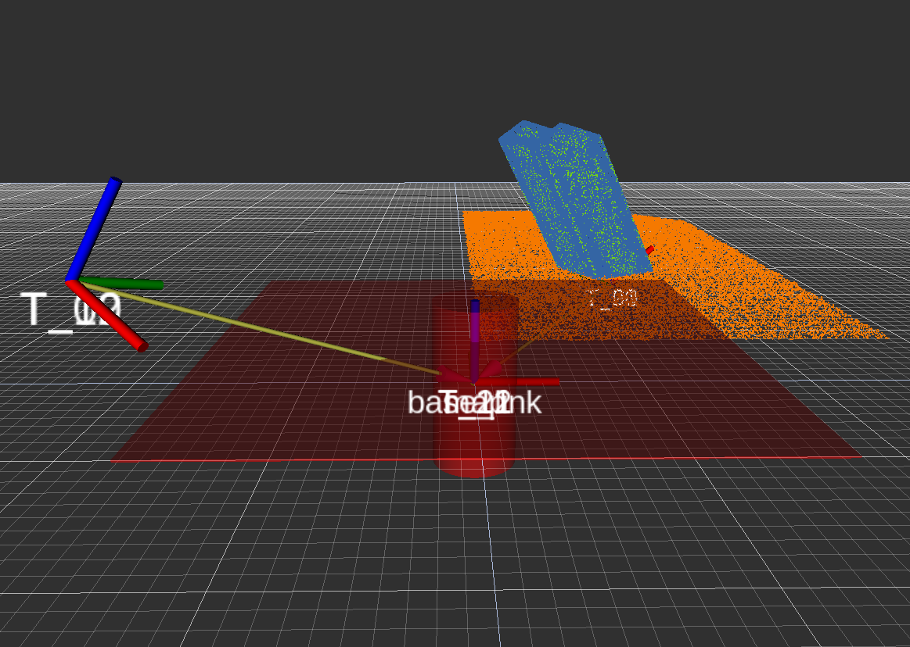
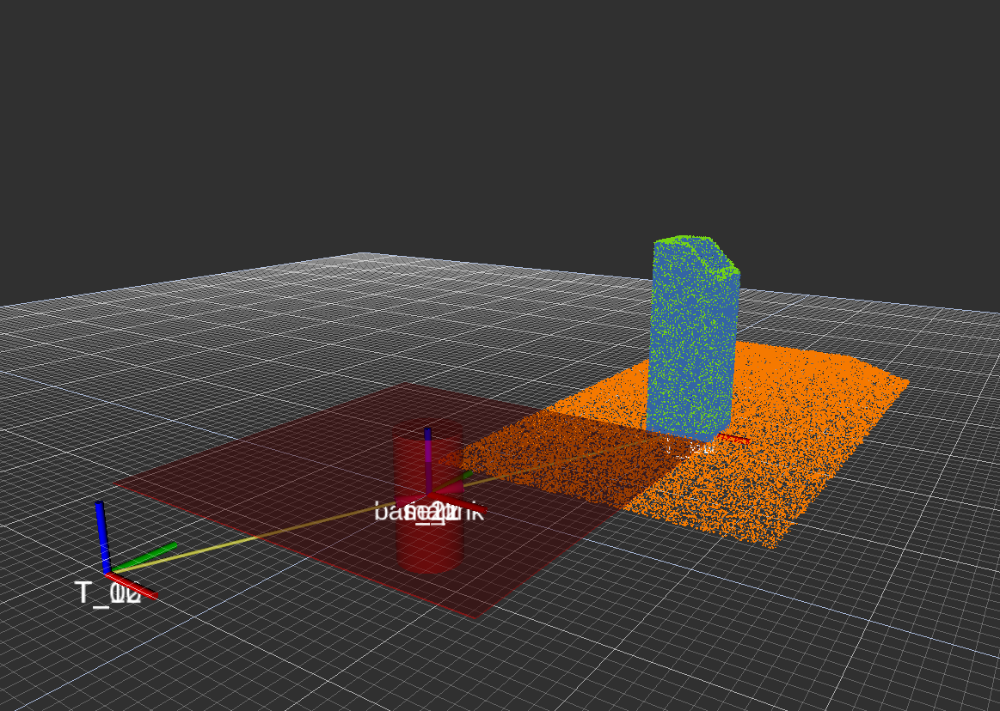

# seam_detection
This is a ROS package for weld seam detection using pointcloud data based on the point cloud library (PCL).





### Installation Instructions for seam_detection 

#### Requirements:
##### Operating System: 
- Ubuntu 18.04 - tested and working best
- Ubuntu 20.04 - testing now, working but not converging
##### ROS Version (linked to OS):
- ROS Melodic
- ROS Noetic
##### Hardware 
- no hardware requirements identified currently

#### Step 1 - Setup ROS workspace
If you want to use a catkin workspace that is already setup, then you can skip **Step 1** (you workspace must compile). If you do not, then create and build a catkin workspace before proceeding. Choose a location and insert a name for the workpace. Typically this is somewhere in `~/`.

```
mkdir -p ~/<workspace-name>/src
cd ~/<workspace-name>
catkin_make
```

This will build your workspace for the first time. There should now be a `CMakeLists.txt` file and a few new directories in the workspace.

#### Step 2 - Download SEAM_DETECTION Package
Change to the source directory of the workapce and pull the package using git.

```
cd ~/<workspace-name>/src
git clone https://github.com/thillRobot/seam_detection.git
```
#### Step 3 - Compile SEAM_DETECTION in catkin workspace
Change to top of workspace and compile.

```
cd ..
catkin_make
```

The workspace and package should compile without errors.


### Using SEAM_DETECTION v1.0

These examples require a pre-recorded pointcloud from a 3D Lidar and/or CAD. There are example scans here.
This code is based on **PCL - Sample Consensus and RANSAC (SEGMENTATION)**
Note: **.pcd** files are currently in the **.gitignore** so you have to generate them locally which is explained below.

<!-- ##### try this one pcd_to_pointcloud - THIS WORKS (02/04/2020)-->
<!--`roslaunch seam_detection segment_plane_line.launch in_file:="test_cloud11.pcd" thresh:=0.01`-->
#### Random Sample Consensus - RANSAC
##### Use RANSAC to fit a models to a pointcloud. 
The library supports planes, cylinders, spheres and more.
```
roslaunch seam_detection ransac_plane.launch in_file:="test_cloud8.pcd" thresh:=0.01
```

##### Use RANSAC to segment, or separate, pointclouds.
```
roslaunch seam_detection segment_plane.launch in_file:="test_cloud8.pcd" thresh:=0.01
```

##### Use RANSAC for weld seam detection. For now it is just locating the origin of the intersection of three planes.
```
roslaunch seam_detection seam_detection_RANSAC.launch in_file:="lidar_scene1.pcd" out_file:="scene1.txt" thresh1:=0.01 thresh2:=0.001
```

#### Iterative Closest Point - ICP
These demos require two points clouds to be saved as `.pcd` files. Use the default images or make you own with the following procedure.
##### Import a cloud from a CAD model: Solidworks(.stl)-->meshlab(.ply)-->cad2cloud(.pcd)-->ROS(pointcloud)

###### Step 1) Make a part in your CAD program of choice. This part will become the 'reference cloud'. Save the file as a '.stl' file. If your CAD program can create a '.ply' or '.pcd' file you can skip steps 2 or 3 respectively.

###### Step 2) Convert the '.stl' to a '.ply' file using meshlab. Open the '.stl' using 'import mesh' and save it as a '.ply' file. Step2 can be done in solidworks. This combines step and step 2. Nice

###### Step 3) Convert the '.ply' to a '.pcd' file using cad_cloud (this is a package I wrote that uses PCL). run the following commands.

```
cd seam_detection

rosrun seam_detection cad_cloud ply_images/input.ply pcd_images/output.pcd -n_samples 100000 -leaf_size 0.001 -write_normals 1 -no_vis_results 0

pcl_viewer -multiview 1 output.pcd
```

###### Step 4) Use ICP to compare the CAD/reference image to the LIDAR/source image. 
The LIDAR '.pcd' file must also be in the image directory. There are four numbered scenes choose from.

```
roslaunch seam_detection seam_detection_ICP.launch lidar_file:="lidar_scene1.pcd" cad_file:="cad_scene1.pcd"  thresh:=0.003
```


##### use ICP for weld seam detection. For now it is just locating the origin of the part.

```
roslaunch seam_detection seam_detection_ICP.launch lidar_file:="plate_cylinder.pcd" cad_file:="cylinder.pcd"  thresh:=0.0001
```

#### RANSAC + ICP SEAM DETECTION - In Development
##### use RANSAC + ICP for weld seam detection. For now it is just locating the origin of the part.

These two examples have the cylinder and the plate only. These work well, but there is a discrepancy along the length of the cylinder. All other dimensions match very well. 
**plate_round_tube_01, round_tube_01** 
```
roslaunch seam_detection seam_detection.launch lidar_file:="plate_round_tube_01.pcd" cad_file:="round_tube_01.pcd" part1_type:="round_tube"
```
**plate_square_tube_01, square_tube_01**
```
roslauncroslaunch seam_detection seam_detection.launch lidar_file:="plate_square_tube_01.pcd" cad_file:="square_tube_01.pcd" part1_type:="square_tube"
```
**plate_square_tube_03, square_tube_03** 
```
roslauncroslaunch seam_detection seam_detection.launch lidar_file:="plate_square_tube_03.pcd" cad_file:="square_tube_03.pcd" part1_type:="square_tube"
```

##### add second plane that represents the table that the parts are sitting on. 
This is not working. RANSAC fails.
```
roslaunch seam_detection seam_detection.launch lidar_file:="table_plate_cylinder.pcd" cad_file:="cylinder.pcd" thresh:=0.0001
```

```
BEGINNING RANSAC SEGMENTATION
Plane coefficients: header: 
seq: 0 stamp: 0 frame_id: 
values[]
  values[0]:   9.70263e-06
  values[1]:   9.7027e-06
  values[2]:   1
  values[3]:   -0.0250056

PointCloud representing the planar component: 2993 data points.
[pcl::SampleConsensusModel::getSamples] Can not select 0 unique points out of 0!
[pcl::RandomSampleConsensus::computeModel] No samples could be selected!
[pcl::SACSegmentationFromNormals::segment] Error segmenting the model! No solution found.
```

### Changelog
#### Versions
- v1.0 (stable - tagged 12/07/2020)
- v1.1 (stable - tagged 12/26/2020)
  - added `round_tube` or `square_tube` segmentation option for part1 
  - added `part1_type` to `seam_detection.launch` args
  - removed `thresh` from `seam_detection.launch` args
- v1.2 (development - master/devel)

#### Prepare for IDETC2021
- [x] create branch called 'stable' to store the working code 
- [x] create tag called v1.0 and document how to use and pull with tag
- [x] design and test new scenes with v1.0 - scenes need edits
- [ ] fix RANSAC segmentation of the table and plate
- [ ] decide to include table or not inlcude table. It will be in the scan so I think the code needs to be able to handle table

- [x] dust off and test workflow for designing new scene and converting to the proper filetypes, this has not been tested recently 
- [x] scaling issue with pcd export in solidworks - use options in save as diaolag 
- [ ] document test scene creation and conversion process
- [ ] improve `cad_cloud` to process multiple .ply files at once - convert entire directory

- [x] figure out square tube RANSAC - working on that now - seems to work fine without cylinder model

   ##### current test scenes
   - [x] fillet weld: `plate_cylinder` -  (cylinder has angled top feature) - tested and works 
   - [ ] fillet weld: `table_plate_cylinder`- does not work - RANSAC segmentation fails
   - [x] fillet weld: lidarfile= `plate_square_tube_01.ply(.pcd)`, cadfile=`square_tube_01.ply(.pcd)` tested and working
   - [x] fillet weld: lidarfile= `plate_square_tube_02.ply(.pcd)`, cadfile=`square_tube_02.ply(.pcd)` tested and working
   - [x] fillet weld: lidarfile= `plate_square_tube_03.ply(.pcd)`, cadfile=`square_tube_03.ply(.pcd)` tested and working

   - [ ] fillet weld: `square tube to plate` - designed by RS - initial tests now
   - [ ] fillet weld: `round tube to plate` - designed by RS - initial tests 
   
   
- [ ] calculate a *measure of accuracy* 
- [ ] determine or register key points on key parts (?)
- [ ] include **.pcd** and/or **.ply** in this **.gitignore** ? 


***The plan is to wait until after IDETC 2021 submission to work on the developement issues below.***
#### Development of `seam detection.cpp` which is implemenation of RANSAC + ICP SEAM DETECTION
   - [x] migration from 'TF'  to 'TF2'. It has already fixed the 'static publisher issue'
   - [ ] The migration is incomplete. Parts of both libraries are currently used. For example `tf::transform` is used for  `pcl_ros::transformPointCloud`. There is probably another way, but I have not figured it out yet.
   - [ ] In REGISTER_CLOUD function in `seam_detection.cpp` I think I could go straight from `ICP` to `TF` and not pull out the values like it is done currently, but it works like that for now.
   - [ ] Multiple parts needs to be developed , cylinder and plate seem to work now
   - [ ] add 'markers' to show the results from RANSAC, the markers are there, but they need the pose info now. (03/06/2020)
   - [ ] begin migration to Fossa/Noetic - everything compiles  and returns
   - [ ] there was a driver issue running the T1600 in Ubuntu 20.04 and Noetic, the driver for the old video card called 'nvidia-340' was not supported for the graphics libraries so I switched to the 'Nouveau' driver and this fixed the 'libgl error no matching fbconfigs or visuals found' issue after that everything runs.
   - [ ] we are running the modern drivers (nvidia455) on the  T1600+GTX1650 GPU, what are we running now on the NUC+ Kaby Lake embedded graphics
   - [ ] the ICP stage does not work. It does converges but the score is too high, and the results do not make any sense. It works in Melodic but not in Noetic. **This is a issue**.


